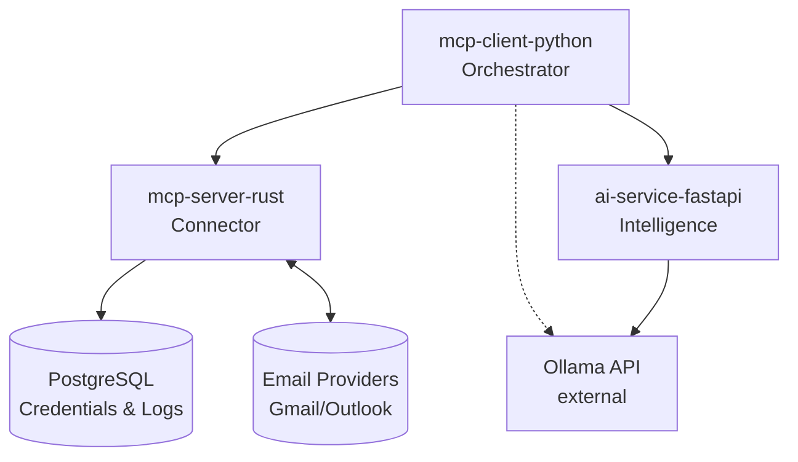

# Email Intelligence Platform (AGUERO)

An advanced email intelligence platform designed to detect and flag threats (phishing, malware, spam) across major providers (Gmail, Outlook, Yahoo). Built using the Model Context Protocol (MCP).

## Core Capabilities
- **Threat Detection:** Classifies phishing, malware, and spam.
- **Priority & Urgency Triage:** Tags emails by importance (Critical, Normal, Low).
- **Promotion Filtering:** Allows users to toggle visibility of ads and newsletters.

## System Architecture

The project is built on a modular, multi-container architecture using Docker Compose:



### 1. `mcp-client-python/` (The Orchestrator)
The brain of the operation. A Python-based MCP client that continuously monitors email accounts, sends content to the AI service for analysis, and commands the Rust server to apply labels or move messages. The decision itself is made by an LLM chosen via `LLM_PROVIDER`: Claude by default (native MCP tool-use), or Ollama (structured JSON decision, executed by the orchestrator) as a local/cheaper alternative.

### 2. `mcp-server-rust/` (The Connector)
A high-performance Rust MCP server operating in dual-mode (Legacy `.env` or Multi-Tenant). It securely fetches user credentials from **PostgreSQL**, decrypts them dynamically via AES-256-GCM, connects to IMAP/OAuth endpoints, and executes safe tools (e.g., `fetch_emails`, `move_email`). It also automatically logs AI classification actions directly into the database.

### 3. `ai-service-fastapi/` (The Intelligence Engine)
A Python FastAPI microservice exposing `POST /analyze`, which classifies one
email by threat level, urgency and category. The service holds all the logic --
prompting, validation, normalisation, and a keyword fallback so a slow or
failing model degrades triage instead of stopping it. Ollama is called as an
external API for the classification itself; nothing runs it here. See
[ai-service-fastapi/README.md](ai-service-fastapi/README.md).

## Getting Started

### 1. Configure Environment Variables

Copy `.env.example` to `.env` and fill in your secrets:
```bash
cp .env.example .env
# then edit .env with your credentials
```

| Variable | Required | Description |
| --- | --- | --- |
| `ANTHROPIC_API_KEY` | If using Claude | Used by `mcp-client-python` when `LLM_PROVIDER=anthropic` (default). |
| `OLLAMA_API_KEY` | Always | Used by `ai-service-fastapi` for email classification. Get one at https://ollama.com/settings/keys |
| `IMAP_USER` | Legacy mode only | Email address for single-user IMAP (bypass DB registration). |
| `IMAP_PASS` | Legacy mode only | Gmail App Password for the single-user account. |
| `ENCRYPTION_KEY` | Recommended | A 32-character random string used to AES-256-GCM encrypt all IMAP passwords in PostgreSQL. **Change the default before deploying!** |

### 2. Start the System

```bash
docker compose up --build
```

All four containers start automatically. PostgreSQL is initialized with the schema on first boot.

### 3. Register Users (Multi-Tenant Mode)

To add a user to the database so the orchestrator can fetch their emails:
```bash
python register_user.py <user_id> <email> <imap_app_password>

# Example:
python register_user.py alice alice@gmail.com xxxx-yyyy-zzzz-aaaa
```

The script calls `POST /register` on the Rust server, which AES-256-GCM encrypts the password
and stores it in PostgreSQL. Once registered, the orchestrator can pass `user_id` in any tool
call to act on that account.

### 4. Verify Health

```bash
curl http://localhost:8000/health   # AI service
curl http://localhost:8080/mcp      # Rust MCP server (opens SSE stream)
docker compose ps                   # All 4 containers should show "healthy" or "running"
```
