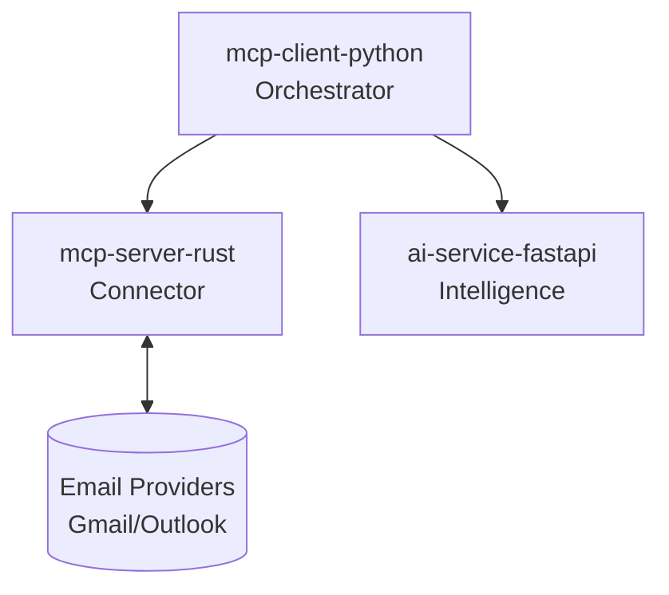

# Email Intelligence Platform (AGUERO)

An advanced email intelligence platform designed to detect and flag threats (phishing, malware, spam) across major providers (Gmail, Outlook, Yahoo). Built using the Model Context Protocol (MCP).

## Core Capabilities
- **Threat Detection:** Classifies phishing, malware, and spam.
- **Priority & Urgency Triage:** Tags emails by importance (Critical, Normal, Low).
- **Promotion Filtering:** Allows users to toggle visibility of ads and newsletters.

## System Architecture

The project is built on a modular, multi-container architecture using Docker Compose:



### 1. `mcp-client-python/` (The Orchestrator)
The brain of the operation. A Python-based MCP client that continuously monitors email accounts, sends content to the AI service for analysis, and commands the Rust server to apply labels or move messages.

### 2. `mcp-server-rust/` (The Connector)
A high-performance Rust MCP server. It connects securely to IMAP/OAuth endpoints of email providers and exposes safe tools (e.g., `fetch_emails`, `move_email`) to the orchestrator.

### 3. `ai-service-fastapi/` (The Intelligence Engine)
A Python FastAPI microservice that hosts the classification and detection models.

## Getting Started

To spin up the entire system locally:
```bash
docker-compose up --build
```
